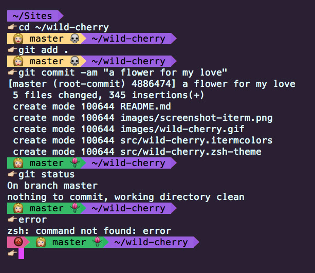
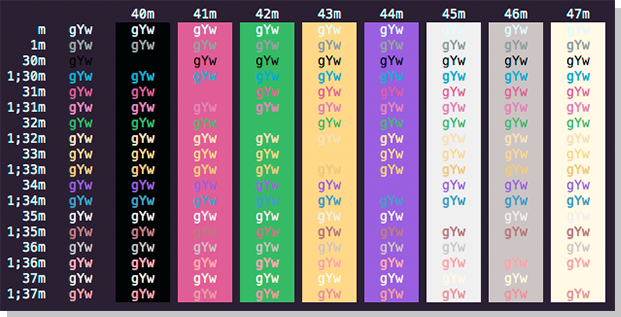
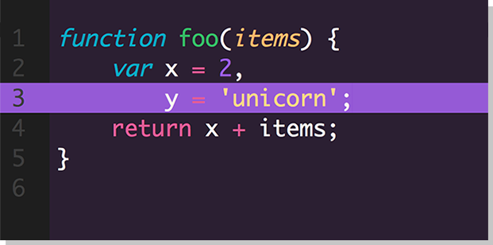
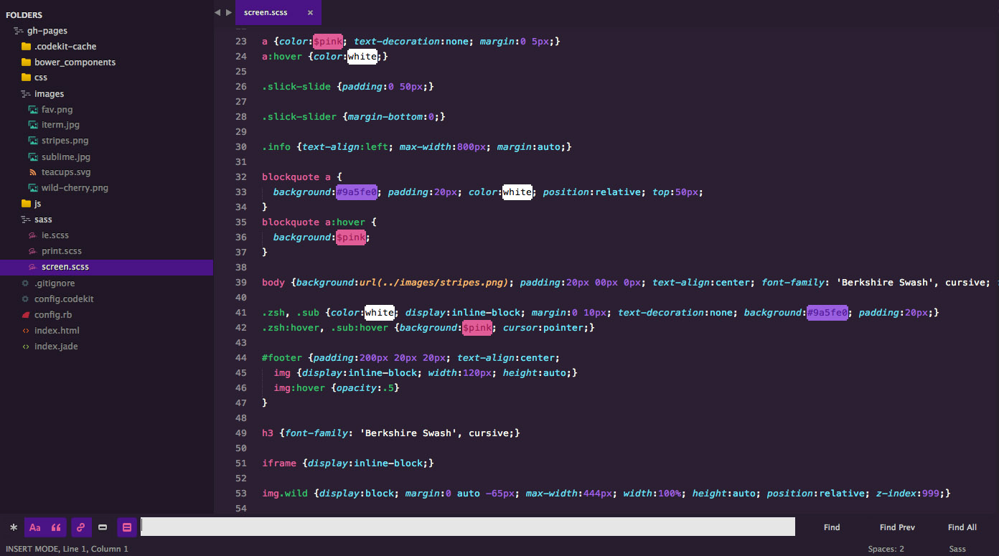

#Wild Cherry

> A fairy-tale inspired theme for [Zsh](http://www.zsh.org/), [iTerm](http://www.iterm2.com/), & [Sublime](http://www.sublimetext.com).

> :skull: Git Princess is close to death.

> :tulip: Commit to her and give her a flower.
 
> :japanese_ogre: Japanese Ogre appears on error. 

 

##Zsh

* This is a customized version of [agnoster](https://gist.github.com/3712874) and [remy](https://remysharp.com/2013/07/25/my-terminal-setup).
* In order for this theme to render correctly, you will need a [Powerline-patched font](https://gist.github.com/1595572).

1. Download using the [GitHub .zip download](https://github.com/mashaal/wild-cherry/archive/master.zip) option and unzip them.
2. Move `src/wild-cherry.zsh-theme` file to [oh-my-zsh](https://github.com/robbyrussell/oh-my-zsh/)'s theme folder: `oh-my-zsh/themes/wild-cherry`.

##### Activating theme

Go to your `~/.zshrc` file and set `ZSH_THEME="wild-cherry"`. Finally, reload your terminal.

##iTerm

##### Activating theme

1. *iTerm2 > Preferences > Profiles > Colors Tab*
2. Click *Load Presets...*
3. Click *Import...*
4. Select the `src/wild-cherry.itermcolors` file
5. Select the *wild cherry* from *Load Presets...*

##Sublime

###Color Scheme

The easiest way to install `Wild Cherry` is via the [Colorsublime](https://github.com/Colorsublime/Colorsublime-Plugin) plugin.

or...

1. Download the files using the [GitHub .zip download](https://github.com/mashaal/wild-cherry/archive/master.zip) option
2. Unzip the files and rename the folder to Wild Cherry
3. Find your Packages directory using the menu item Preferences -> Browse Packages...
4. Copy the folder into your Sublime Text Packages directory

#### Activating the theme

Go to `Preferences -> Color Scheme -> User` and select `Wild Cherry`.

###UI

* This is a customized version of the [Cobalt2](https://github.com/wesbos/cobalt2) UI.

